# AWS Event-Driven Bills Pipeline

An event-driven serverless pipeline on AWS that automatically processes bill records uploaded to S3, routes them through SQS, validates and transforms them in Lambda, and stores the results in DynamoDB — with full error handling and CloudWatch observability.

---

## Project Overview

| Field | Details |
|---|---|
| **Cloud Provider** | AWS |
| **Core Services** | S3, SQS, Lambda, DynamoDB, CloudWatch |
| **Language** | Python 3.x (boto3) |
| **Trigger Model** | Event-driven (S3 → SQS → Lambda) |
| **Storage** | DynamoDB (NoSQL, on-demand) |
| **Configuration** | Environment variables (no hardcoded values) |
| **Error Handling** | Field-level validation with CloudWatch logging |
| **IAM** | LabRole with S3, SQS, DynamoDB, and CloudWatch permissions |

---

## Architecture

```
┌─────────────────────────────────────────────────────────────────┐
│                    AWS Event-Driven Pipeline                    │
│                                                                 │
│  ┌──────────────┐    Event      ┌─────────────┐                 │
│  │   Producer   │  Notification │             │                 │
│  │  (producer   │──────────────▶│  S3 Bucket │                  |
│  │    .py)      │   PUT Object  │  bills/     │                 │
│  └──────────────┘               │  {uuid}.json│                 │
│                                 └──────┬──────┘                 │
│                                        │                        │
│                                        │  S3 Event Notification │
│                                        ▼                        │
│                                 ┌─────────────┐                 │
│                                 │     SQS     │                 │
│                                 │ bills-queue │                 │
│                                 └──────┬──────┘                 │
│                                        │                        │
│                                        │  SQS Trigger           │
│                                        ▼                        │
│                                 ┌─────────────┐                 │
│                                 │   Lambda    │                 │
│                                 │  bills-     │                 │
│                                 │  processor  │                 │
│                                 └──────┬──────┘                 │
│                                        │                        │
│                         ┌──────────────┼──────────────┐         │
│                         │              │              │         │
│                         ▼              ▼              ▼         │
│                   ┌──────────┐  ┌──────────┐  ┌──────────┐      │
│                   │ DynamoDB │  │    S3    │  │CloudWatch│      │
│                   │  bills   │  │(read file│  │  Logs    │      │
│                   │  table   │  │ content) │  │          │      │
│                   └──────────┘  └──────────┘  └──────────┘      │
└─────────────────────────────────────────────────────────────────┘

Flow:
  1. producer.py uploads bills/{uuid}.json to S3
  2. S3 fires event notification → SQS bills-queue
  3. SQS triggers Lambda bills-processor (batch size: 10)
  4. Lambda reads file from S3, validates required fields
  5. Valid records → inserted into DynamoDB bills table
  6. Invalid records → logged to CloudWatch, skipped (no crash)
```

---

## AWS Services

| Service | Resource Name | Purpose |
|---|---|---|
| **S3** | `apatel638-bills-bucket` | Stores uploaded bill JSON files under `bills/` prefix |
| **SQS** | `bills-queue` | Decouples S3 events from Lambda; buffers messages |
| **Lambda** | `bills-processor` | Core processing logic — validates, transforms, stores |
| **DynamoDB** | `bills` | Persists processed bill records (partition key: `billId`) |
| **CloudWatch** | `/aws/lambda/bills-processor` | Captures SUCCESS and ERROR logs for all invocations |
| **IAM** | `LabRole` | Grants Lambda permissions across S3, SQS, DynamoDB |

---

## Repository Structure

```
aws-event-driven-bills-pipeline/
├── README.md
├── lambda_function.py
├── producer.py
└── screenshots/
    ├── bills-pipeline-1.jpg
    ├── bills-pipeline-2.jpg
    ├── bills-pipeline-3.jpg
    ├── bills-pipeline-4.jpg
    ├── bills-pipeline-5.jpg
    ├── bills-pipeline-6.jpg
    ├── bills-pipeline-7.jpg
    ├── bills-pipeline-8.jpg
    ├── bills-pipeline-9.jpg
    ├── bills-pipeline-10.jpg
    └── bills-pipeline-11.jpg
```

---

## Step-by-Step Setup

### Step 1 — DynamoDB Table

Created the `bills` table with `billId` (String) as the partition key and on-demand capacity mode. This table is the final destination for all successfully processed bill records from Lambda.

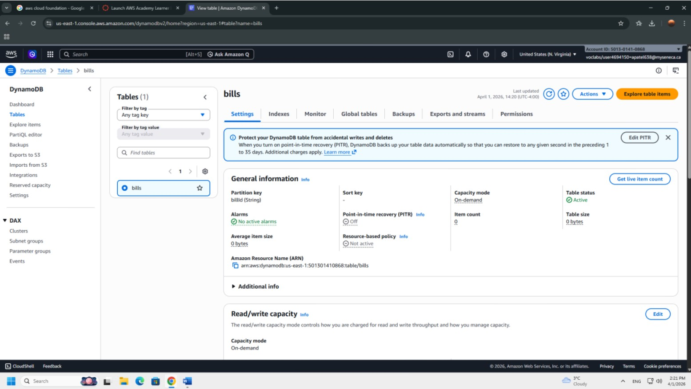

---

### Step 2 — S3 Bucket

Created S3 bucket `apatel638-bills-bucket`. Verified the bucket was empty before beginning pipeline testing. The producer program uploads files into the `bills/` prefix using a UUID-based filename pattern.

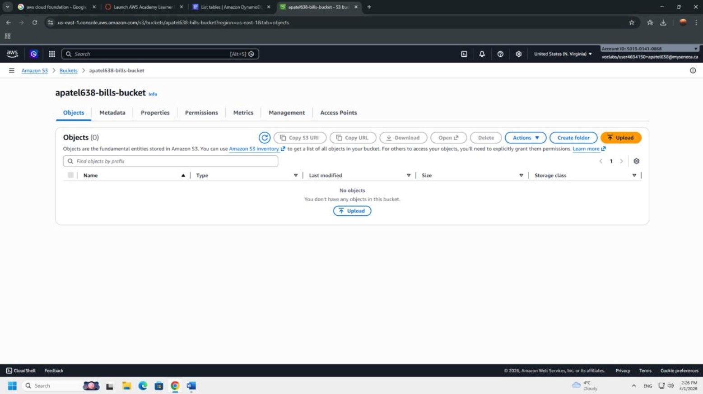

---

### Step 3 — SQS Queue

Created a Standard SQS queue named `bills-queue`. Standard queues were chosen over FIFO because bill processing does not require strict ordering, and Standard queues provide higher throughput and at-least-once delivery, which suits this workload.

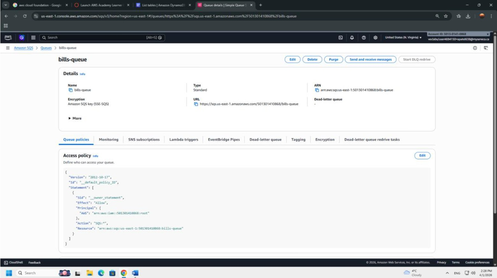

---

### Step 4 — S3 to SQS Integration

Configured S3 to send all `ObjectCreated` events to `bills-queue`. This required updating the SQS access policy to explicitly grant S3 the `SQS:SendMessage` permission — S3 cannot publish to SQS without this, and the initial attempt failed with an Unknown Error until the policy was corrected.

**SQS Access Policy:**

```json
{
  "Version": "2012-10-17",
  "Statement": [
    {
      "Sid": "AllowS3SendMessage",
      "Effect": "Allow",
      "Principal": {
        "Service": "s3.amazonaws.com"
      },
      "Action": "SQS:SendMessage",
      "Resource": "arn:aws:sqs:us-east-1:501301410868:bills-queue",
      "Condition": {
        "ArnLike": {
          "aws:SourceArn": "arn:aws:s3:::apatel638-bills-bucket"
        }
      }
    }
  ]
}
```

The `ArnLike` condition scopes the permission so only this specific bucket can write to the queue — not any S3 bucket in the account.

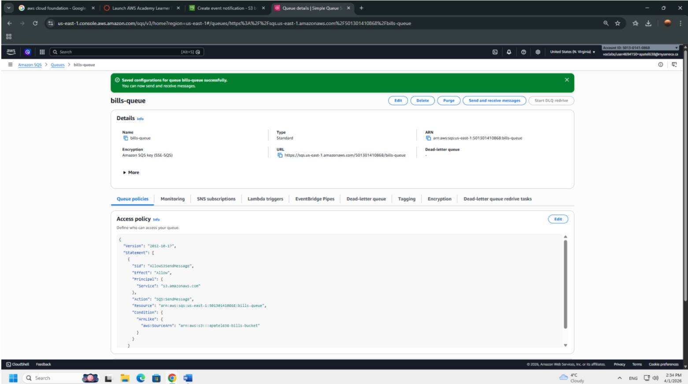

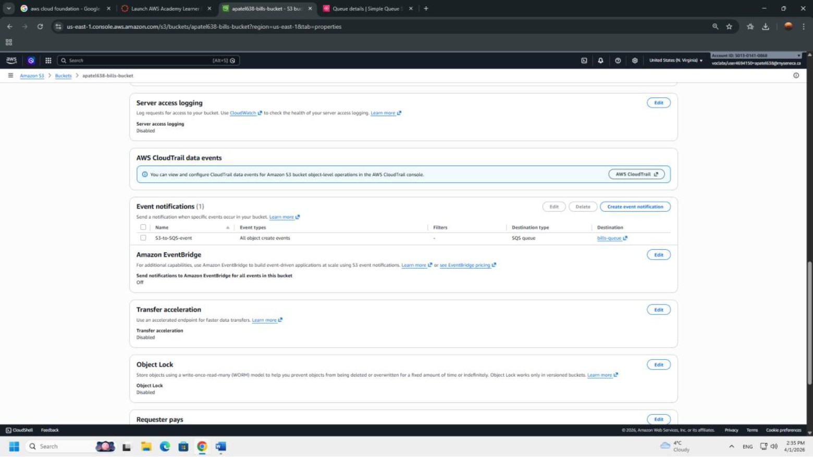

---

### Step 5 — Lambda Function

Created the Lambda function `bills-processor` with Python 3.x runtime. Assigned the `LabRole` execution role, which provides the cross-service permissions required: reading from S3, consuming from SQS, and writing to DynamoDB.

---

### Step 6 — SQS Trigger

Attached `bills-queue` as an event source trigger for the Lambda function with a batch size of 10. This means Lambda can process up to 10 SQS messages per invocation, making the pipeline efficient under load.

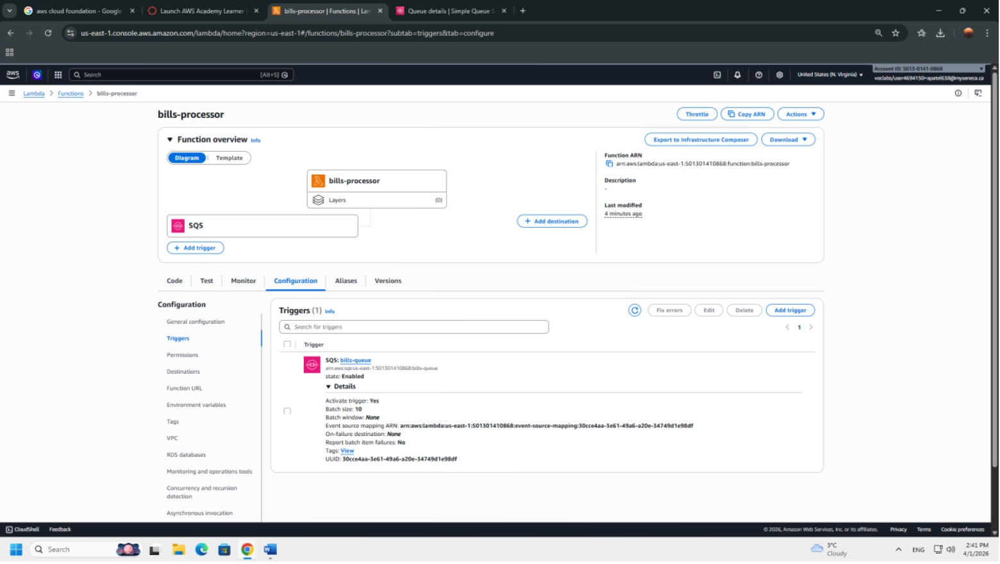

---

### Step 7 — Environment Variables

Rather than hardcoding resource names in the Lambda code, both the S3 bucket name and DynamoDB table name are injected as environment variables. This makes the function portable across environments without any code changes.

| Variable | Value |
|---|---|
| `S3_BUCKET` | `apatel638-bills-bucket` |
| `DYNAMODB_TABLE` | `bills` |

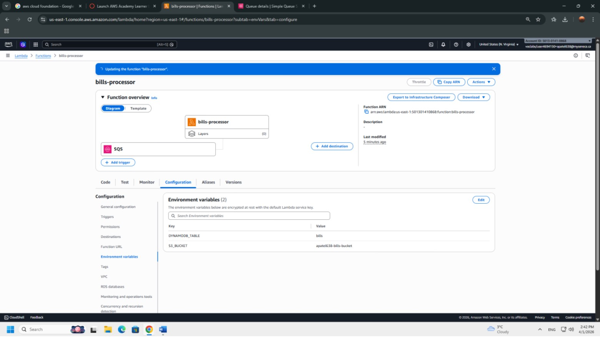

---

### Step 8 — Lambda Function Code

The Lambda handler processes each SQS record in the batch individually. It reads the S3 object referenced in the message, validates the presence of all three required fields, and writes a structured item to DynamoDB — including metadata like the S3 key and a UTC timestamp.

Full source: [`lambda_function.py`](lambda_function.py)

---

### Step 9 — Producer Program

The producer simulates an upstream service that generates bill records and uploads them to S3. Each run creates a new UUID-keyed JSON file under the `bills/` prefix, which automatically triggers the full pipeline.

Full source: [`producer.py`](producer.py)

**Run from AWS CloudShell:**

```bash
python3 producer.py
```

---

## Pipeline Verification

### S3 — Object Created

After running the producer, the JSON file appears in the `bills/` folder inside the S3 bucket, confirming the upload succeeded and the event notification was triggered.

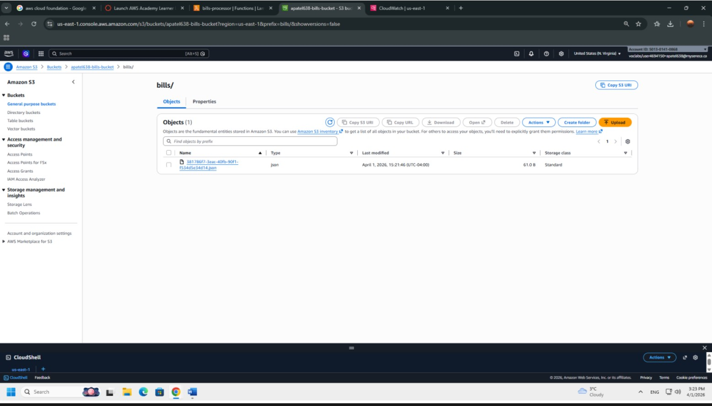

---

### CloudWatch — Lambda SUCCESS Log

CloudWatch logs confirm the Lambda function was invoked via SQS, fetched the file from S3, and logged `SUCCESS: File processed` for the uploaded object.

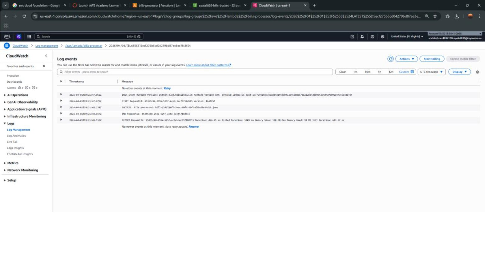

---

### DynamoDB — Record Inserted

The `bills` table shows the inserted item with all expected attributes: `billId`, `accountNumber`, `billNumber`, `amountDue`, `s3Bucket`, `s3Key`, and `processedAt`.

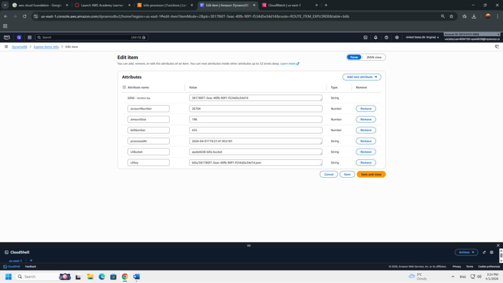

---

## Error Handling

To validate the Lambda's field-level error handling, the producer was modified to omit `accountNumber` and re-run. The Lambda detected the missing field, logged a descriptive error to CloudWatch, used `continue` to skip the record without crashing, and wrote nothing to DynamoDB.

**CloudWatch — ERROR logged, no crash:**

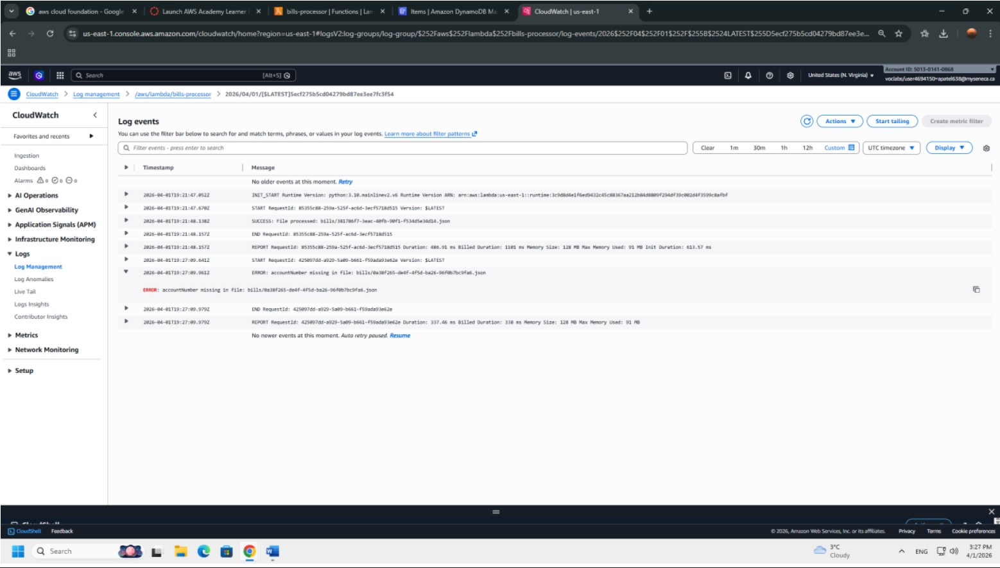

**DynamoDB — Record count unchanged:**

The table still shows only 1 item after the invalid upload — confirming the Lambda correctly skipped the bad record and DynamoDB was not polluted with incomplete data.

---

## Challenges & Solutions

| Challenge | Root Cause | Solution |
|---|---|---|
| S3 event notification to SQS failed with Unknown Error | SQS access policy did not grant `SQS:SendMessage` to S3 principal | Added explicit policy statement with `ArnLike` condition scoping permission to the specific bucket ARN |
| Lambda not authorized to read S3 / write DynamoDB | Default Lambda execution role lacked cross-service permissions | Assigned `LabRole` which carries the necessary managed policies for S3, SQS, and DynamoDB access |
| Resource names risked being hardcoded | Hardcoding bucket/table names breaks portability and is a security anti-pattern | Moved all resource identifiers to Lambda environment variables, referenced via `os.environ` |
| Invalid records could crash the Lambda mid-batch | Unhandled exceptions in one record would fail the entire SQS batch | Wrapped each record in `try/except` with per-field validation using `continue` to skip bad records gracefully |

---

## Key Learnings

**SQS access policies are not optional when receiving from S3.** S3 cannot publish events to an SQS queue using its own permissions — the queue must explicitly allow the S3 service principal via a resource-based policy. The `ArnLike` condition is the correct way to scope this, not a broad allow.

**Decoupling with SQS adds resilience the pipeline would otherwise lack.** Without SQS, S3 could invoke Lambda directly — but that creates tight coupling and loses the ability to buffer, retry, or inspect messages. SQS gives the system durability between the event source and the processing layer.

**Per-record error handling is essential in batch processing.** Lambda SQS triggers process records in batches. If one record causes an unhandled exception, the entire batch fails and is retried — including records that already succeeded. Using `try/except` with `continue` per record isolates failures and prevents unnecessary re-processing.

**Environment variables are the minimum standard for resource references in Lambda.** Hardcoding S3 bucket names or DynamoDB table names makes functions environment-specific and creates maintenance risk. Environment variables allow the same deployment package to run across dev, staging, and production with zero code changes.

**CloudWatch logs are the primary debugging surface for serverless.** There is no SSH, no local console, and no interactive debugger in Lambda. Structured print statements — with clear SUCCESS/ERROR prefixes — are what make a serverless function observable and diagnosable in production.

---

## Related Projects

| # | Project | Repo |
|---|---|---|
| 1 | Two-Tier Terraform Web App | `aws-terraform-two-tier-webapp` |
| 2 | EC2 Web Server Deployment | `aws-ec2-webserver-deployment` |
| 3 | News API Lambda + S3 | `aws-news-api-lambda` |
| 4 | **AWS Event-Driven Bills Pipeline** | `aws-event-driven-bills-pipeline` ← you are here |
